# Evidence-Grounded Literature RAG

[中文说明](README.zh-CN.md)

An end-to-end literature analysis system that discovers academic papers, converts them into searchable evidence, and uses retrieval-augmented LLM extraction to build structured material knowledge.

This repository is intentionally presented as an **LLM application backend and deterministic document workflow**, not as a production-ready autonomous agent. Every capability below is labeled according to the code that is currently present.

## Project snapshot

- **Backend:** Java 17, Spring Boot, PostgreSQL/pgvector, Redis, and Elasticsearch.
- **RAG:** Markdown-aware chunking, 2048-dimensional embeddings, paper-scoped Top-K retrieval, and two-stage structured extraction with evidence chunks.
- **Workflow:** a 15-state paper lifecycle with bounded concurrency, retry, stale-task recovery, and an optional Outbox/RocketMQ path.
- **Verified run:** the local custom RAG interface listed 92 vectorized papers and completed an evidence-grounded DeepSeek query using DashScope embeddings; the corpus and vectors are not included.
- **Checks:** 8 offline backend tests passed, 13 environment-gated integration tests were skipped, and the frontend type check and production build passed.

## Personal contribution and AI assistance

I was responsible for the backend system and the Elasticsearch integration, including implementation, integration, and verification. AI-assisted development tools were used for code suggestions, refactoring, debugging, and documentation support. Elasticsearch text and structured-material search are implemented; vector population and hybrid score fusion remain partial and are not claimed as completed work.

## What problem does it solve?

Domain experts often need to read many papers and extract repeated facts such as material names, experimental conditions, measured properties, and supporting passages. This project turns that manual process into a traceable pipeline:

1. Search arXiv, CORE, and Semantic Scholar.
2. Pre-screen title and abstract relevance with an LLM.
3. Download and transform PDFs into Markdown.
4. Split the document with Markdown-aware rules.
5. create embeddings and store chunks in PostgreSQL/pgvector.
6. Retrieve evidence inside each paper.
7. Run two-stage material identification and property extraction.
8. Persist structured observations and expose text, metric, and research interfaces.

The main value is not “calling an LLM.” It is placing a probabilistic model inside a stateful, retryable, evidence-aware backend.

## Running evidence and reuse boundary

### Petroleum literature mode: implemented UI

#### 1. Operations dashboard

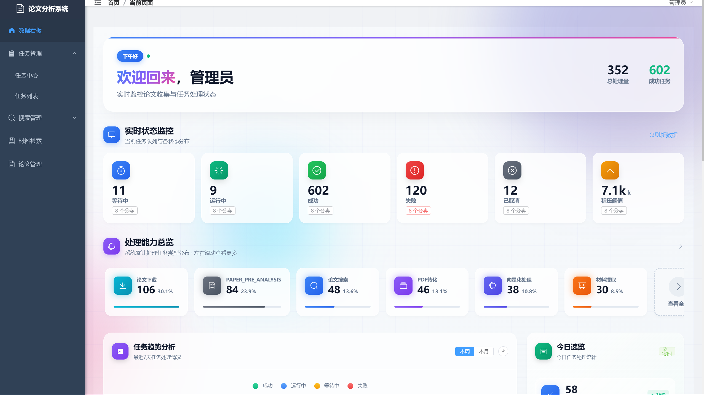

*Figure 1. Runtime dashboard showing queued, running, successful, failed, and cancelled tasks together with download, pre-analysis, search, transform, embedding, and extraction workloads.*

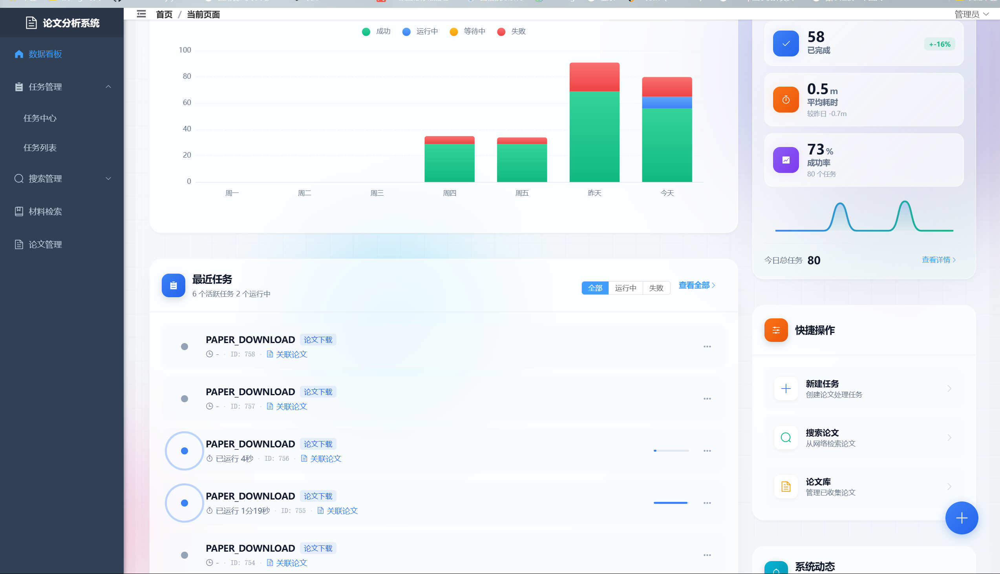

*Figure 2. Task trend chart, daily throughput, recent job states, and shortcuts for creating tasks, searching papers, and opening the paper library.*

#### 2. Multi-source academic search configuration

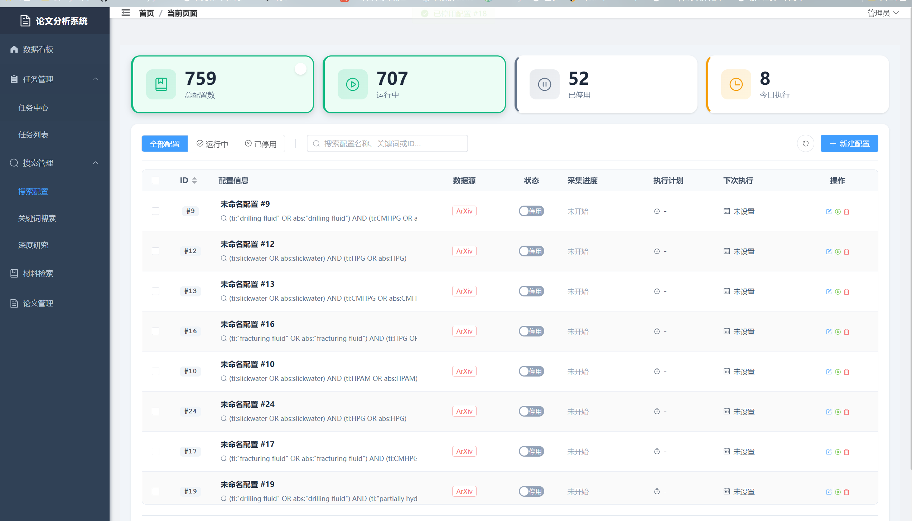

*Figure 3. Persisted search configurations for petroleum terms across academic providers, including execution state and scheduling controls.*

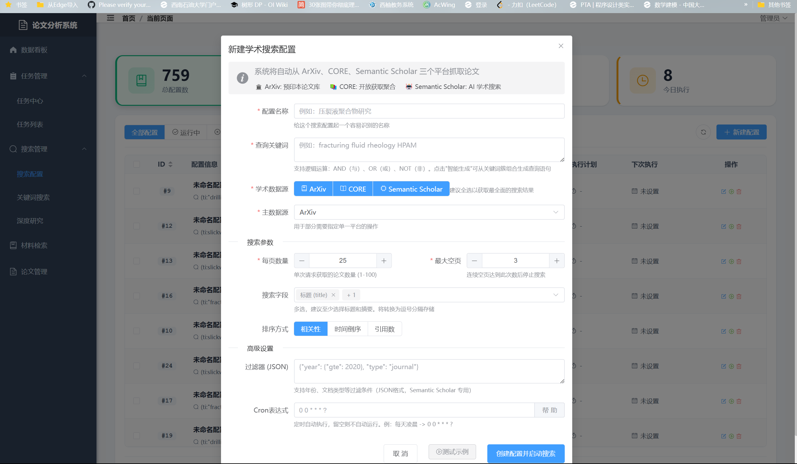

*Figure 4. Search form for arXiv, CORE, and Semantic Scholar with query, source, pagination, ordering, filter, and schedule settings.*

#### 3. Paper ingestion and processing

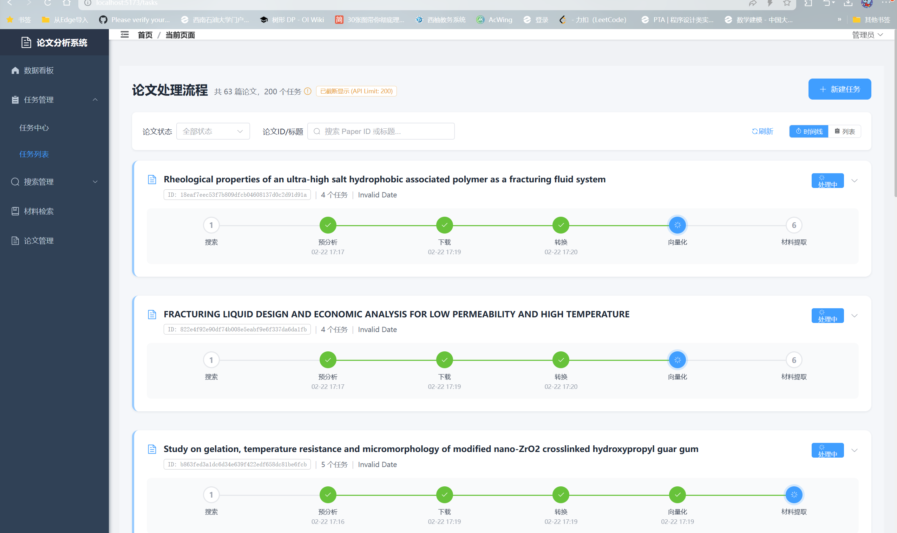

*Figure 5. Per-paper state progression from relevance pre-analysis through download, transform, embedding, and material extraction.*

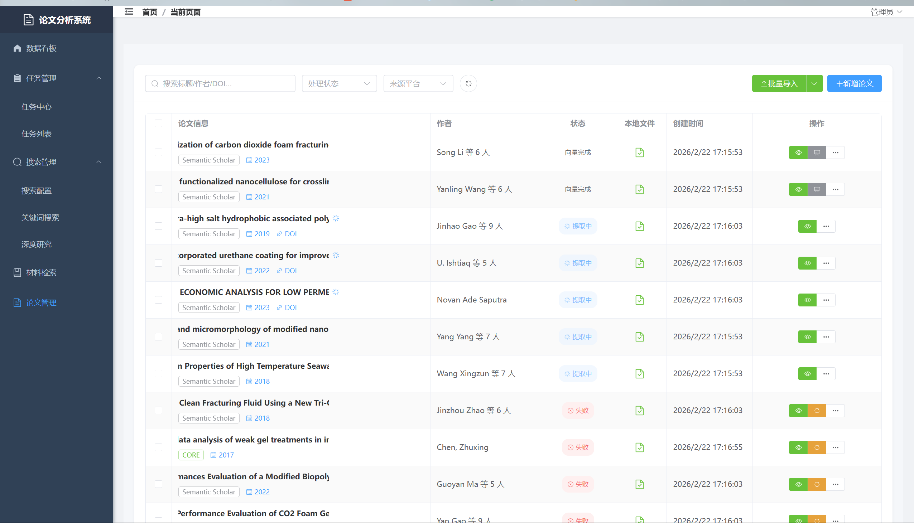

*Figure 6. Paper workspace showing petroleum-related literature moving through vectorization, extraction, failure, and retry states.*

#### 4. Extracted material knowledge base

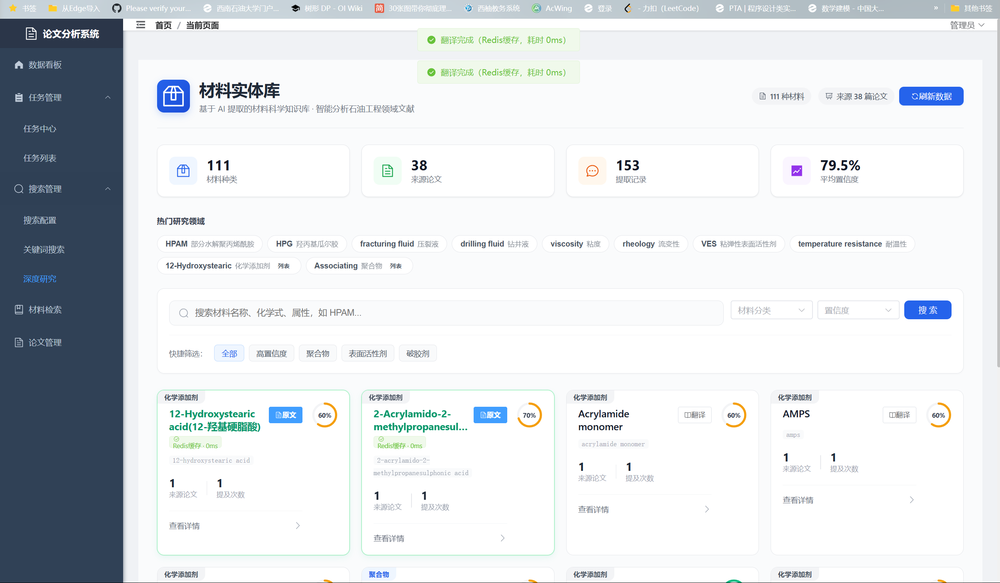

*Figure 7. Material entity library with petroleum terminology, source-paper counts, extraction counts, confidence, search, filtering, and Redis-backed translation indicators.*

#### 5. Structured extraction and evidence traceability

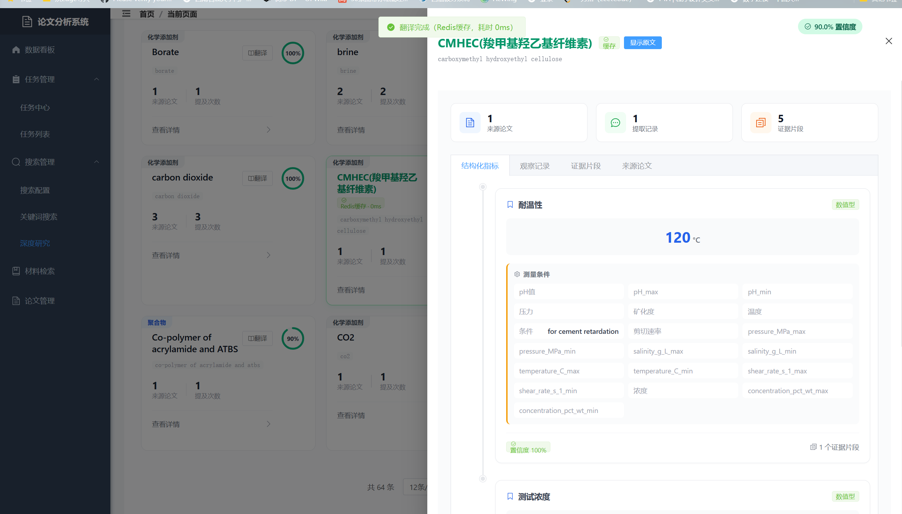

*Figure 8. Structured material metrics, including temperature resistance and associated experimental conditions, confidence, and linked evidence counts.*

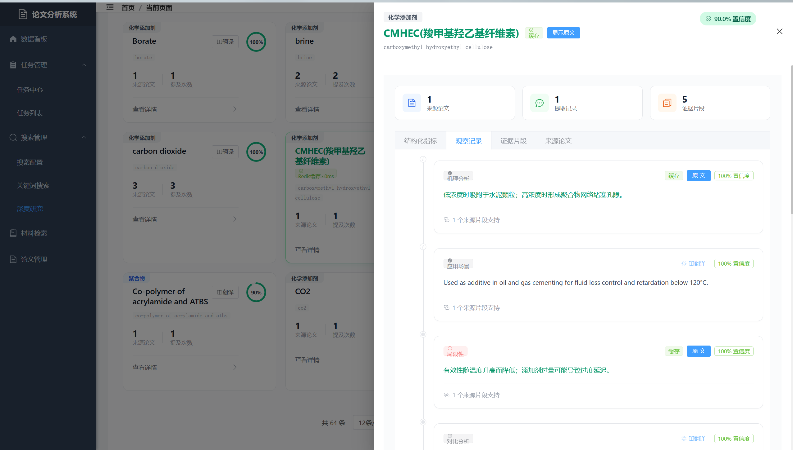

*Figure 9. Observation records describing mechanisms, application context, limitations, confidence, translation state, and supporting passages.*

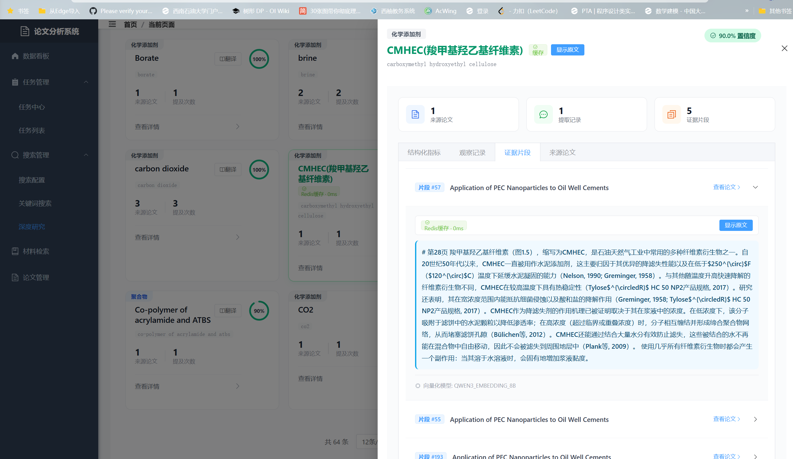

*Figure 10. Evidence tab exposing the actual indexed chunks used to support the extracted CMHEC result.*

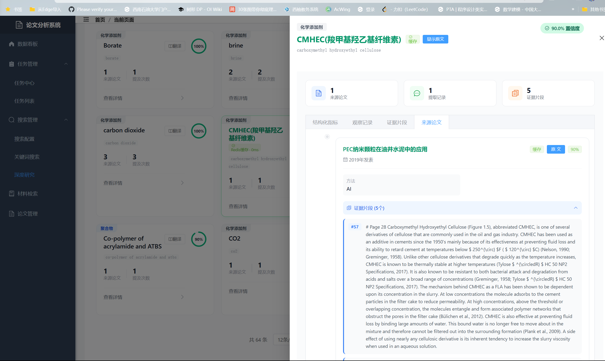

*Figure 11. Source-paper tab connecting the extracted entity back to its paper metadata and the evidence passages retained for review.*

Together, these eleven screenshots cover system monitoring, task orchestration, retrieval configuration, ingestion, per-paper processing, structured metrics, observations, evidence passages, and source traceability. They demonstrate the implemented petroleum-paper workflow, but do not by themselves prove accuracy on an unrelated corpus.

### Reusable document RAG path

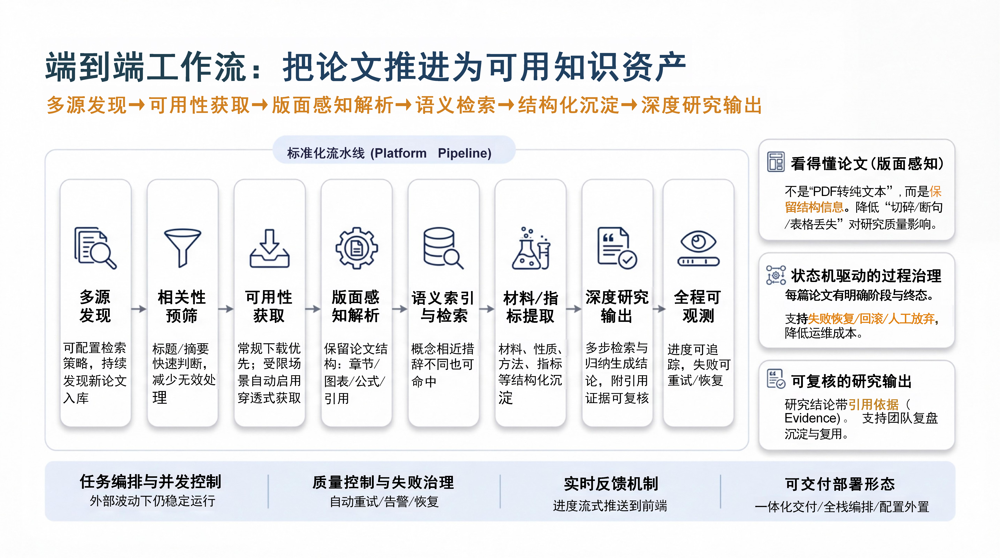

*Figure 12. Document-processing workflow used by the project. The operational and deployment labels at the bottom describe design targets; verified runtime boundaries are listed in the capability table below.*

The reusable boundary is in the backend pipeline and configuration:

| Layer | Petroleum specialization | Reusable path for another domain |
|---|---|---|
| Sources | arXiv, CORE, and Semantic Scholar queries for oil-and-gas papers | Replace or add source adapters and import authorized documents |
| Parsing and chunking | Academic PDFs, Markdown structure, tables, formulas, and citations | Keep the pipeline and tune `DocumentChunkSplitter` for the target document structure |
| Retrieval | `DocumentContextRetriever` performs pgvector Top-K retrieval inside one `documentId` | Reuse the same retriever after indexing the new domain corpus |
| Generation | Material identification and property-extraction prompts | Enable `/api/rag/query` and configure `RAG_CUSTOM_SYSTEM_PROMPT` |
| Evidence | Material observations retain candidate Chunk IDs and passages | Generic responses return the exact truncated chunks supplied to the model |

Therefore, the repository contains a working petroleum-literature specialization and a configurable single-document RAG baseline. A new domain still requires its own corpus, metadata rules, prompt, and evaluation set before domain accuracy can be claimed.

## Capability status

| Capability | Status | Evidence / boundary |
|---|---|---|
| arXiv, CORE, Semantic Scholar search adapters | Implemented, external runtime pending | SearchExecutor implementations and provider-specific rate limits exist |
| Relevance pre-analysis | Implemented | Prompt, threshold, DTO parsing, state transition, and task processor exist |
| PDF download and transform gateways | Implemented, provider-dependent | Local, MinerU, PaddleOCR, and DeepSeek OCR paths exist; external services are not bundled |
| Markdown-aware chunking | Implemented | Heading, paragraph, fenced block, table handling, configurable size and overlap |
| PostgreSQL pgvector storage and retrieval | Implemented | document_chunk uses vector(2048); retrieval filters by paper then applies cosine distance |
| Two-stage material RAG | Implemented | material identification followed by property extraction with candidate chunk IDs |
| Optional generic document RAG | Implemented, disabled by default | configuration-gated REST endpoint reuses per-document pgvector retrieval and returns the chunks sent to the model |
| PostgreSQL full-text Deep Research | Implemented | rule-based QueryRouter, FTS/SQL research tools, SSE response |
| Elasticsearch text and structured material search | Implemented | mapping, analyzer, filters, nested queries, bulk synchronization paths |
| Elasticsearch vector/hybrid retrieval | Partial | vector field and request parameters exist, but vector population and score fusion are not closed |
| Native JSON Schema structured output | Not implemented | JSON shape is enforced through prompts, cleaning, Jackson parsing, and DTOs |
| HNSW/IVFFlat ANN | Not implemented | current material extraction performs exact ranking within one paper |
| Autonomous Agent / multi-agent planning | Not implemented | orchestration is deterministic; the model does not choose arbitrary tools |

The full declaration-to-evidence audit is in [CLAIM_EVIDENCE_MATRIX.md](docs/CLAIM_EVIDENCE_MATRIX.md).

## Architecture

~~~mermaid
flowchart LR
    UI["Vue 3 UI"] --> API["Spring Boot REST / SSE"]
    API --> APP["Application services and task orchestration"]
    APP --> DOMAIN["Paper aggregate, 15-state lifecycle, transition rules"]
    APP --> SEARCH["arXiv / CORE / Semantic Scholar"]
    APP --> TRANSFORM["Download and PDF-to-Markdown gateways"]
    APP --> INDEX["Chunking and embedding"]
    INDEX --> PG[("PostgreSQL + pgvector")]
    APP --> RAG["Material extraction / optional document QA"]
    RAG --> PG
    APP --> RESEARCH["FTS / metric tools + LLM response"]
    RESEARCH --> PG
    APP --> ES[("Elasticsearch text search")]
    APP --> REDIS[("Redis cache / coordination")]
    APP -. optional .-> MQ["RocketMQ mode"]
~~~

### RAG data flow

~~~mermaid
sequenceDiagram
    participant T as Transform
    participant C as Chunker
    participant E as Embedding model
    participant V as pgvector
    participant R as Retriever
    participant L as Chat model
    participant P as PostgreSQL

    T->>C: Markdown + paper metadata
    C->>E: Configurable batches of chunks
    E-->>C: 2048-dimensional vectors
    C->>V: Upsert paper_id + order_no + content + vector
    R->>E: Material, property, or user query
    E-->>R: Query vector
    R->>V: Exact top-K within paper_id
    V-->>R: Candidate chunks
    R->>L: Prompt + evidence labels
    L-->>R: JSON-like structured result + chunk IDs
    R->>P: Materials, observations, metrics, evidence links
~~~

## Repository layout

~~~text
.
├── backend/                 Java 17 / Spring Boot application
│   ├── src/main/java/       DDD-style domain, application, infrastructure, interfaces
│   ├── src/main/resources/  configuration and MyBatis mappers
│   ├── src/test/            offline tests and opt-in integration tests
│   └── sql/                 PostgreSQL + pgvector schema and patches
├── frontend/                Vue 3 / Vite application
├── docs/                    architecture, audit, customization, and security notes
├── README.md                English documentation
└── README.zh-CN.md          Chinese documentation
~~~

## Technology stack

| Layer | Technology |
|---|---|
| Backend | Java 17, Spring Boot 3.5.5, Spring AI 1.1.0-M4, MyBatis-Plus |
| LLM integration | OpenAI-compatible chat and embedding APIs |
| Primary database | PostgreSQL, pgvector, JSONB, tsvector |
| Search | PostgreSQL FTS and Elasticsearch Java Client 8.11.4 |
| Cache / coordination | Redis and Redisson |
| Optional messaging | Spring events by default; RocketMQ profile is optional |
| Frontend | Vue 3, Vite 7, Element Plus, ECharts, Axios |

## Quick start

### Prerequisites

- JDK 17 and Maven 3.6+
- Node.js 20.19+ or 22.12+
- PostgreSQL with pgvector, Redis, and Elasticsearch 8.11.x (Elasticsearch may run in Docker Desktop)
- A chat-model API key and an embedding API key for the full AI pipeline

### 1. Configure

~~~bash
cp backend/.env.example backend/.env
cp frontend/.env.example frontend/.env
~~~

At minimum, configure SPRING_DATASOURCE_URL, SPRING_DATASOURCE_USERNAME, and SPRING_DATASOURCE_PASSWORD. Configure OPENAI_API_KEY and OPENAI_EMBEDDING_API_KEY before running LLM and embedding stages.

No usable key is committed. See [SECURITY_AUDIT.md](docs/SECURITY_AUDIT.md).

### 2. Prepare local infrastructure

Start PostgreSQL/pgvector on port 5432, Redis on 6379, and Elasticsearch on 9200 using your local services or Docker Desktop. Then initialize a new PostgreSQL database with backend/sql/paper_collector_schema.sql.

A compose file is deliberately not included: this setup uses Docker Desktop only for Elasticsearch while PostgreSQL/pgvector and Redis run as local services, so no complete Compose stack has been verified.

### 3. Start the backend

~~~bash
cd backend
mvn spring-boot:run
~~~

The default API origin is http://localhost:8080.

### 4. Start the frontend

~~~bash
cd frontend
npm install
npm run dev
~~~

The Vite development server proxies /api to the backend. Set VITE_API_ORIGIN only when the API is hosted on a different origin.

## Configuration contract

| Variable | Required | Purpose |
|---|---|---|
| SPRING_DATASOURCE_URL / USERNAME / PASSWORD | Yes | PostgreSQL connection with pgvector installed |
| OPENAI_API_KEY | For LLM stages | OpenAI-compatible chat endpoint credential |
| OPENAI_BASE_URL | Optional | Chat endpoint; defaults to DeepSeek-compatible URL |
| OPENAI_CHAT_MODEL | Optional | Chat/reasoning model |
| OPENAI_EMBEDDING_API_KEY | For vector stages | Embedding credential |
| OPENAI_EMBEDDING_BASE_URL | Optional | Embedding endpoint |
| OPENAI_EMBEDDING_MODEL | Optional | Provider model name |
| OPENAI_EMBEDDING_DIMENSION | Optional | Must match PostgreSQL vector(2048); default 2048 |
| CORE_API_KEY | Optional | CORE search |
| SEMANTIC_SCHOLAR_API_KEY | Optional | Higher Semantic Scholar quota |
| PAPER_STORAGE_PATH | Optional | Server-visible PDF directory |
| APP_CORS_ALLOWED_ORIGINS | Optional | Comma-separated browser origins |
| LOCAL_FILE_OPEN_FOLDER_ENABLED | Optional | Defaults false; local workstation convenience only |
| RAG_CUSTOM_ENABLED | Optional | Registers the generic `POST /api/rag/query` endpoint; defaults false |
| RAG_CUSTOM_TOP_K | Optional | Default number of chunks retrieved per query; 1–20, default 8 |
| RAG_CUSTOM_MAX_CONTEXT_CHARS | Optional | Upper bound for evidence text sent to the chat model; default 12000 |
| RAG_CUSTOM_SYSTEM_PROMPT | Optional | Trusted deployment-level instructions for the selected research domain |

## Verification snapshot

Audited on 2026-08-03:

- Backend: JDK 17 clean compilation and Maven test succeeded.
- Tests discovered: 21; passed offline: 8; skipped integration tests: 13; failures: 0.
- Integration tests require RUN_INTEGRATION_TESTS=true plus configured PostgreSQL and Elasticsearch.
- Frontend type check passes with vue-tsc.
- Vite produced the production bundle; large chunks remain a documented performance issue.
- The application was started against local PostgreSQL/pgvector, Redis, and Elasticsearch (Docker Desktop), and one end-to-end custom RAG query was verified with DeepSeek Chat and DashScope `text-embedding-v4`.

## Important limitations

- There is no complete authentication/authorization layer. Treat the current server as a local-development or trusted-network application.
- Local PDF endpoints validate paper IDs and storage boundaries, but the folder-opening operation remains disabled by default.
- Prompt-constrained JSON is not equivalent to provider-enforced JSON Schema.
- Candidate chunk storage does not prove that every generated statement is entailed by its cited chunk.
- The Elasticsearch hybrid path is incomplete; PostgreSQL per-paper vector retrieval is the working vector RAG.
- The generic RAG endpoint is intentionally document-scoped and has no corpus-wide ranking or access-control layer.
- No copyrighted paper corpus, database dump, embedding dump, or model output log is included.
- No benchmark currently proves Recall@K, faithfulness, latency, or cost improvements.
- The repository has no license until ownership and third-party asset rights are clarified.

## Optional custom document RAG

The material extraction workflow remains the default. A smaller generic question-answering endpoint can be enabled for experiments on any document that has already passed through the existing transform, chunk, embedding, and pgvector stages. The UI document selector calls `GET /api/rag/documents` and lists every paper that currently has at least one non-null vector chunk; the verified local database contained 92 such papers.

~~~properties
RAG_CUSTOM_ENABLED=true
RAG_CUSTOM_TOP_K=8
RAG_CUSTOM_MAX_CONTEXT_CHARS=12000
RAG_CUSTOM_SYSTEM_PROMPT=Answer only from the supplied evidence and use the terminology of the target domain.
~~~

Restart the backend, then query one indexed document:

~~~bash
curl -X POST http://localhost:8080/api/rag/query \
  -H "Content-Type: application/json" \
  -d '{"documentId":"existing-paper-id","question":"What conclusions are supported by this document?","topK":6}'
~~~

### Verified live example

The following result was generated on 2026-08-03 by the running system, using DashScope `text-embedding-v4` (2048 dimensions) for query embedding and DeepSeek `deepseek-chat` for evidence-grounded generation.

- Document: *Preparation of a novel fracturing fluid with good heat and shear resistance*
- Question: “According to the paper, what formulation and experimental results demonstrate the fracturing fluid's heat and shear resistance?”
- Result: the answer identified the 0.3 wt% MAS-1 + 0.8 wt% Zr-CL formulation, approximately 135 mPa·s viscosity after 120 minutes at 150 °C and 170 s⁻¹, and the reported high-shear viscosity-retention comparison. Six retrieved chunks were returned for inspection.

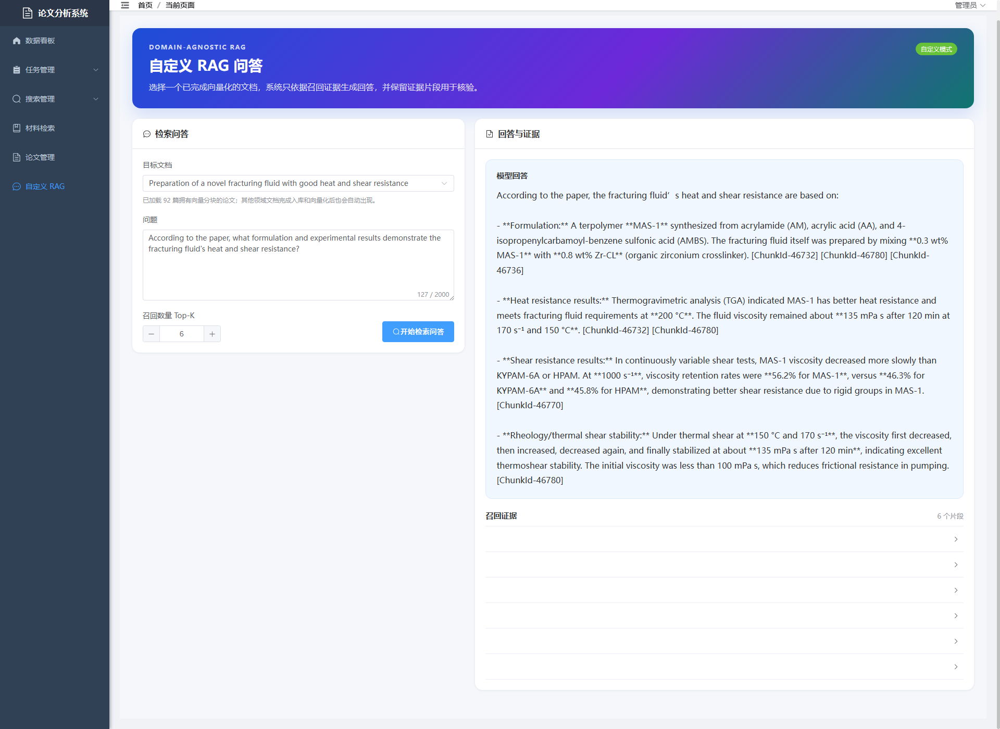

*Figure: real custom RAG execution. Credentials were supplied only through process environment variables and are not stored in the repository.*

When retrieval is empty, the endpoint returns `abstained: true` and does not call the chat model. `documentId` currently maps to the existing `paper_id`, so this mode is a reusable per-document baseline rather than a multi-tenant knowledge-base platform.

For another research domain, replace or extend the source adapter and parser, tune `DocumentChunkSplitter`, change the trusted system prompt, add required metadata filters, and build a labeled evaluation set. Change the embedding model, configured dimension, pgvector schema, and stored vectors as one migration.

See [CUSTOMIZING_RAG.md](docs/CUSTOMIZING_RAG.md) for legal, medical, finance, enterprise knowledge-base, and technical-document examples.

## Further documentation

- [Architecture and audit report](docs/AUDIT_REPORT.md)
- [Claim-to-evidence matrix](docs/CLAIM_EVIDENCE_MATRIX.md)
- [RAG customization guide](docs/CUSTOMIZING_RAG.md)
- [Security audit](docs/SECURITY_AUDIT.md)

## License

No license is currently granted. Add one only after confirming ownership of the code, screenshots, and any third-party assets.
